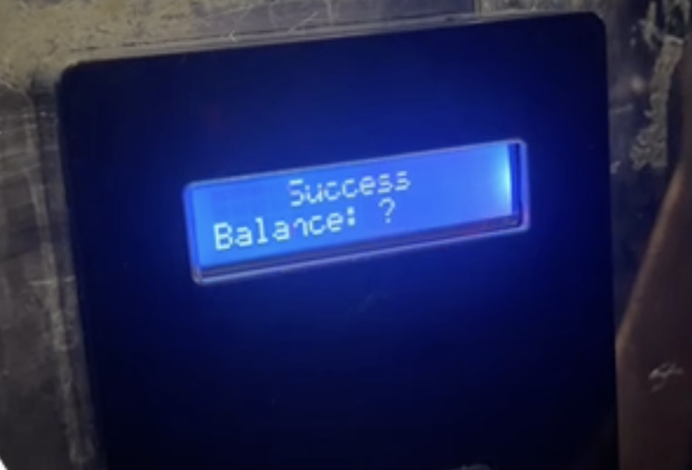

# CityCom Fuzzer

Flipper Zero external app for testing CityCom-compatible elevator readers that use MIFARE Classic
1K cards.

## Features

- Emulates a MIFARE Classic 1K card on Flipper Zero F7.
- Generates a new random 4-byte UID on demand.
- Calculates the ISO 14443-A BCC as the XOR of the UID bytes.
- Supports manual and automatic UID rotation.
- Displays the UID, BCC, ATQA, SAK, current mode, and emulation status.

## Controls

| Button | Action |
| --- | --- |
| `Right` | Generate and emulate a new UID in manual mode |
| `Up` | Toggle manual mode and automatic mode |
| `Back` | Stop the app |

Automatic mode rotates the UID every 100 ms. The current UID and BCC are always shown on screen.

## Observed security issue

Some CityCom elevator readers show the following behavior for an unknown card UID:

1. On the first presentation, the reader displays `Success` and `Balance: ?`, then permits a ride.
2. On the second presentation of the same UID, the reader displays `invalid card` and rejects it.
3. After an unknown period of time, the same UID may be accepted again as if it were new.

Example of the first-presentation response:



This suggests that the reader may temporarily trust or cache an unknown UID before invalidating it,
instead of requiring a validated card record before granting access. The exact re-acceptance interval
has not been measured and may depend on the reader model, firmware, and backend state. This project
can help reproduce the behavior with test UIDs, but it does not claim a specific root cause.

## Card profile

The app uses the following fixed profile:

- Card: MIFARE Classic 1K
- UID: random 4-byte value
- ATQA: `00 04`
- SAK: `08`
- Payload marker: `LTD CityCom2017` in sector 1, block 4
- BCC: XOR of the four UID bytes

The card data is generated in memory at runtime. No NFC dump is required to build or run the app.

## Requirements

- Flipper Zero F7
- A firmware version compatible with the official release SDK selected by uFBT
- Python 3 and [uFBT](https://github.com/flipperdevices/flipperzero-ufbt)

## Build and install

Install uFBT and select the official F7 release SDK:

```bash
python3 -m pip install ufbt==0.2.6
python3 -m ufbt update --channel release --hw-target f7
```

Build the FAP from the project directory:

```bash
python3 -m ufbt
```

The build artifact is written to:

```text
dist/citycom_fuzzer.fap
```

To build, upload, and launch over USB:

```bash
python3 -m ufbt launch
```

Alternatively, copy `dist/citycom_fuzzer.fap` to the `apps/NFC/` directory on the Flipper SD card.

## Development checks

Run the formatter/linter and build locally:

```bash
python3 -m ufbt lint
python3 -m ufbt
```

Run the host-side protocol tests:

```bash
cc -std=c11 -Wall -Wextra -Werror -I. \
  citycom_fuzzer_protocol.c tests/test_protocol.c \
  -o /tmp/citycom_fuzzer_protocol_test
/tmp/citycom_fuzzer_protocol_test
```

GitHub Actions runs these checks automatically for pushes and pull requests.

## Limitations

- The app targets the Flipper Zero F7 only.
- The card profile is intentionally fixed to the CityCom-compatible test data described above.
- This project does not read cards, recover keys, or write physical cards.
- Reader behavior and compatibility depend on the target hardware and firmware.

## License

Released under the [MIT License](LICENSE).
